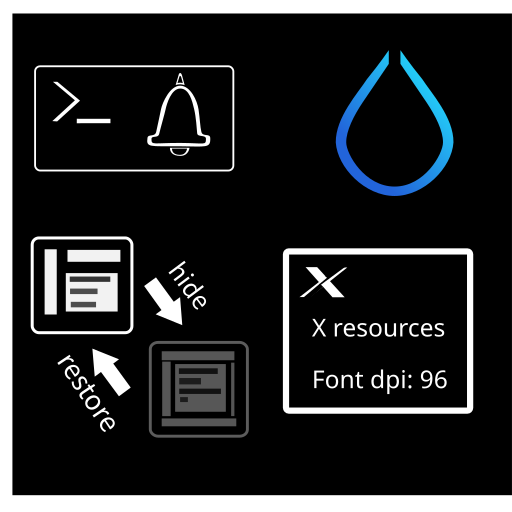

中文（[简体](README_zh.md)）| English

## Hypr_handled



Note: Hypr_handled is only available when Hyprland is running.

Hypr_handled is an application that includes these features:

- Handles `xdg-system-bell-v1` event from the window manager
(Some apps trigger system bell via `xdg-system-bell-v1`, e.g., Kitty terminal).
- Sets font DPI via Xresources.
- Moves a window from a special workspace to the current workspace.

You can use `hypr-minimize.sh -m` to move an active window from the current workspace to a special workspace named `minimized`.

Hypr_handled requires `xrdb` for setting font DPI
and `gsettings` for getting the sound theme.

This application is written in Rust.
You can use the command below
if you want to build the application on your device.

Build:

```
cargo build --release
```
